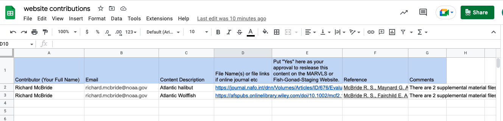

layout: true

.footnote[U.S. Department of Commerce | National Oceanic and Atmospheric Administration | National Marine Fisheries Service]

```{r setup, include=FALSE}
options(htmltools.dir.version = FALSE)
```

---

## Am I qualified to give this presentation?

I would wager that this feeling is shared among most of us.   
The myths I tell myself:

* I am not a good enough coder

* I don't know github well enough

* There are errors in my analysis that will be discovered

* There are many NOAA policies and forms prevent me from joining in

---

## Open Science State of Mind

* (Openscapes Mindset) [https://docs.google.com/presentation/d/1giEW0EIYVnxneGpOBSJnEqg-1CVBUGrbH8Z5gawdeBc/edit#slide=id.p]


  
---


## Tools & Tricks That Make it Possible


  
---
## Resources Available 

* [Openscapes](https://www.openscapes.org/)       
-[Cohorts - science centers and group shared learning](https://drive.google.com/drive/folders/10MykRskNoP4E0YCwup8rzIeZVm2gA3fO)       -Julia Lowndes (julia@openscapes.org)

* [NMFS R user group](https://nmfs-opensci.github.io/NMFS-R-UG/)        
-For information on upcoming meetings and resources
-Eli Homes and many more

* [NMFS Openscience Repo](https://github.com/orgs/nmfs-opensci/repositories)        
-Github guide       
-Quarto simple website template       
-Quarto report        
-Xaringan presentation (template used for this presentation)        

* [NOAA Fisheries Toolbox](https://noaa-fisheries-integrated-toolbox.github.io/)        
-Kathryn Doering

---

## Examples - Repeatable Reports
.left-column[
* [R Markdown Biosampling Inventory Report](https://repository.library.noaa.gov/view/noaa/45018)       
-Three Regions        
-Hundreds of Species        
-Updated Annually             
- [Github Repo](https://github.com/NOAA-LHP/Biosampling-Inventory)
]

.right-column[
```{r, eval=TRUE, echo=FALSE, out.width=400, out.height=400}
knitr::include_graphics("temp.png")
```
]

---

## Getting Started with Quarto and NOAA templates


---
## Examples -Supplimentary Files for Publications

* [Schemmel & Dahl 2023](https://github.com/MARVLS/Fish-Gonad-Staging/tree/main/analyses/Variola_louti_Schemmel_2023)


* McBride example


---


## Examples MARVLS Website

* (Simple website template)[] 
* New quarto template available

---

## MARVLS Website Purpose
Support MARVLS to:

* Hold meetings and workshops

* standardize methodology

* share accomplishments and challenges

* provide mentorship

* increase collaboration among scientists

---

## MARVLS Websites & Github Organization

* [MARVLS Website]()
Organize quarterly workshops and share MARVLS content

* [MARVLS Learning Center]()
Share code and analysis, recent MARVLS papers,fish developmental sequences, histology interpretation, stains, etc

* NOAA policy approved - policies enforced differently at each science center


---

## How to Contribute 1


.left-column[

[Please use issues for requesting changes to content](https://github.com/MARVLS/MARVLS/issues)

* Request change to text or report a typo

* Request format change

]
.right-column[
.hand-blue[


]
]

---

## How to Contribute 2

.left-column[

[Add Analyses ](https://github.com/MARVLS/Fish-Gonad-Staging/tree/main/analyses)

* Add R code for reproduction assessments here

* Use Pull Requests

]
.right-column[
.hand-blue[


]
]

---


## How to Contribute 3


[Add New Content ](https://docs.google.com/spreadsheets/d/1uC-vGAvOSiUSke6Y5pjCHCtO8hYK2HbuVZVa9b2t2p8/edit?usp=share_link)
* [Shared Drive -Contribute](https://drive.google.com/drive/u/0/folders/1YeBkEyTUlrrj5RuktUUJJ42J0cS9t_Vp)    
* Suggest new content

* Use google sheet

* Add the files that are not available online into the "Contributions" folder





---

## Histology Reference Template


.left-column[

[A template to document developmental sequences.](https://docs.google.com/presentation/d/1l6yKgd4srDlrYsEKtlQsRh-1FmZTicOrgmigT4Az-lo/edit#slide=id.p3)

* This template is useful for teaching and provides additional details that make them great references.


]
.right-column[
.hand-blue[


]
]


