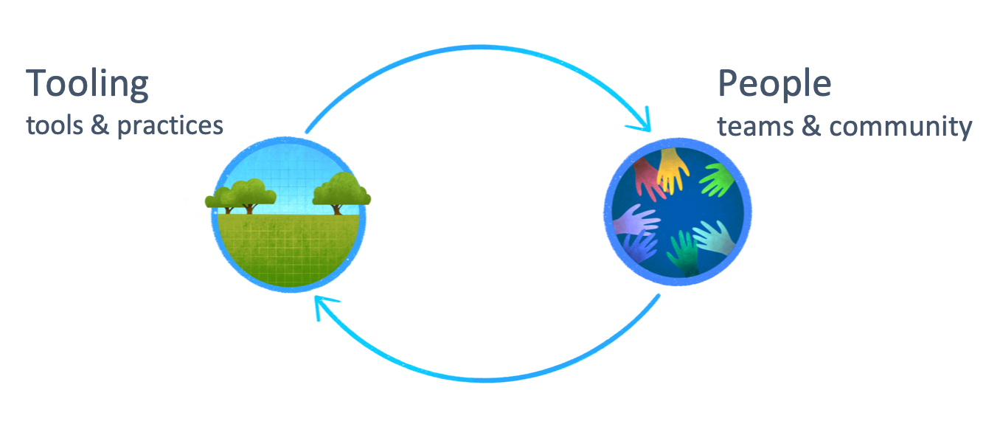
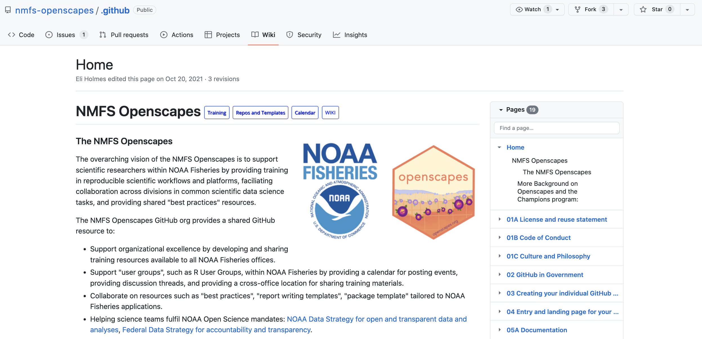
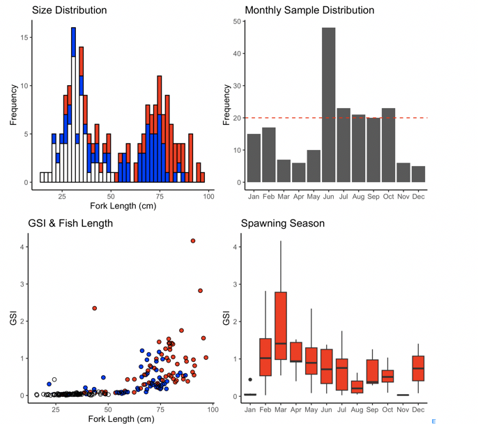
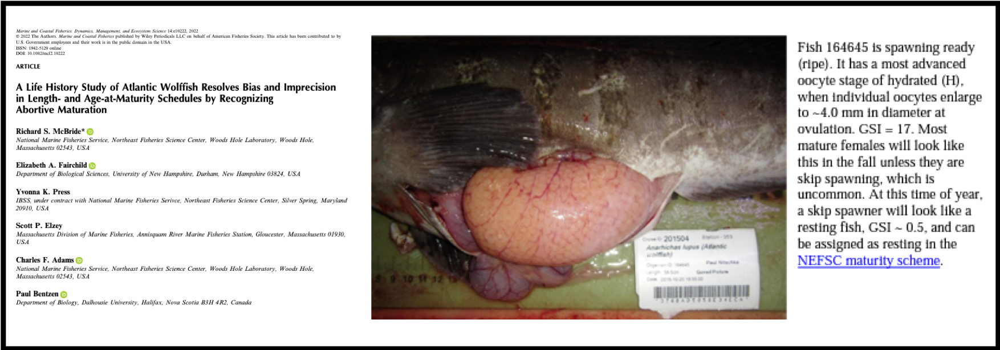
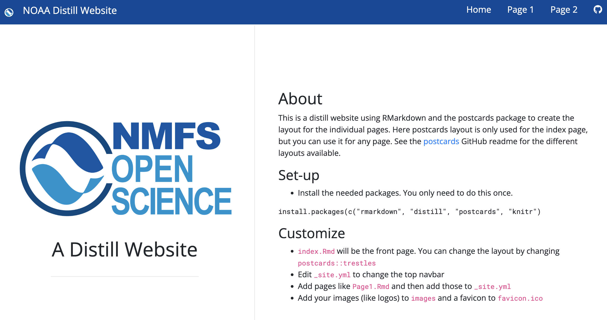
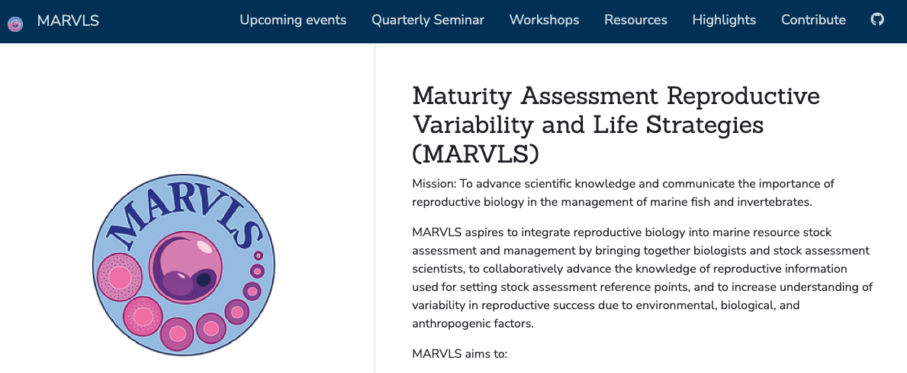
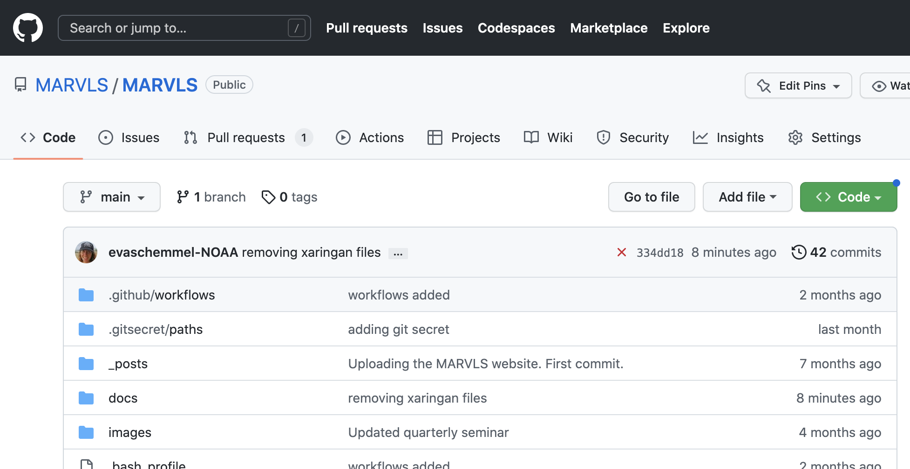
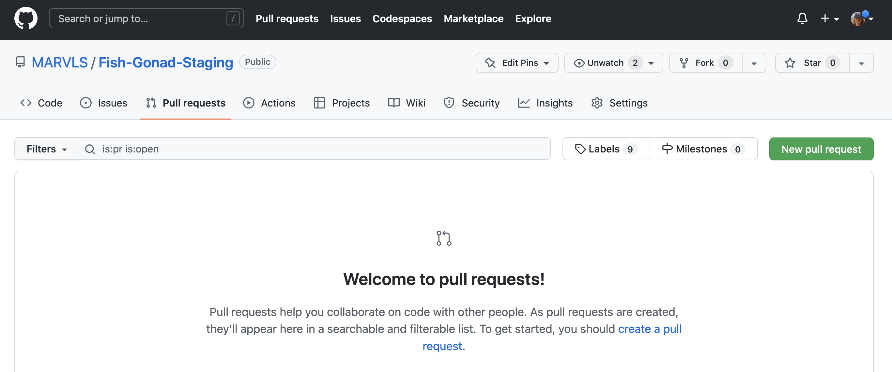
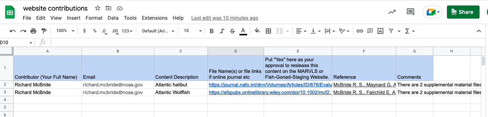
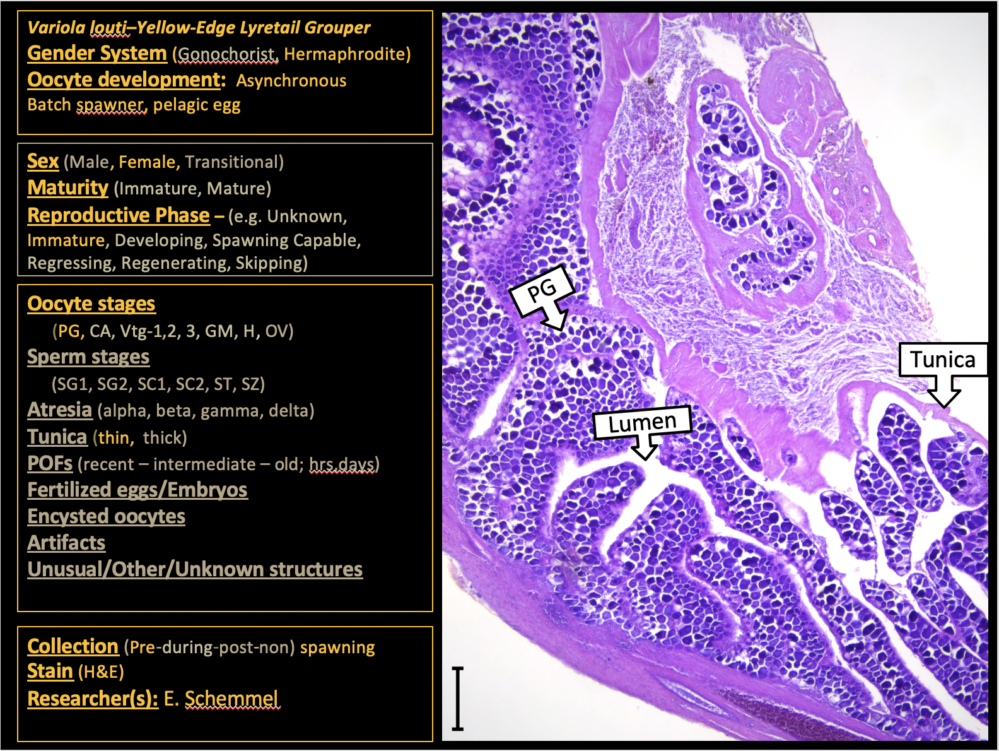

layout: true

.footnote[U.S. Department of Commerce | National Oceanic and Atmospheric Administration | National Marine Fisheries Service]

```{r setup, include=FALSE}
options(htmltools.dir.version = FALSE)
```

---

## What & Why

--

What: 
Open and available science.

--

Why:

* Repeatable - future self and others

--

* Efficient - don't reinvent the wheel 

--

* Collaborative  - multiple people can work on the same documents and project

--

* Version control - can eliminate "doc_final_final.doc"

---

## Barriers to Entry

The myths I tell myself:
* I am not a good enough coder

* There are errors in my analysis that will be discovered

* I don't know the programs/github well enough

* NOAA policies prevent me from joining in -> actuality NOAA Open Science mandates


---

## Open Science State of Mind

* (Openscapes Slides) [https://docs.google.com/presentation/d/1giEW0EIYVnxneGpOBSJnEqg-1CVBUGrbH8Z5gawdeBc/edit#slide=id.p]

--

* Reframe your work as a collaborative effort not a individual burden 

--

* Redefine collaborators & community – Future You, Future Us            
 - New perspectives, tools, methods, ideas, colleagues, allies
 
--

* Reimagine challenges – expect there is a better way           
 - Reuse not reinvent: reduce lonely struggles & cognitive load
 
--

* Open as a daily practice - efficient, collaborative, inclusive, kind            
 - Share imperfect work, have empathy, learn & teach together          
 - Requires trust and time: slow down to speed up
  
---


## Tools & Learning Groups Make it Possible



Openscapes image

  
---
## Where to Begin
  
  * [NMFS Openscapes GitHub org](https://github.com/nmfs-openscapes/.github/wiki) 
   - training resources
   - NOAA policies and instructions for setting up NOAA github account
   - links to NOAA open science mandates
   
```{r, eval=TRUE, echo=FALSE, out.width= "70%"}

```   
   
   
---
## Tools & Resources Available 
* [RVerse Tutorials](https://rverse-tutorials.github.io/)       
-Eli Homes' website and repo for everything R and github (and more)

* [Openscapes](https://www.openscapes.org/)       
-[Cohorts - science centers and group shared learning](https://drive.google.com/drive/folders/10MykRskNoP4E0YCwup8rzIeZVm2gA3fO)               
 -Julia Lowndes (julia@openscapes.org)

* [NMFS R user group](https://nmfs-opensci.github.io/NMFS-R-UG/)        
-For information on upcoming meetings and resources

* [NMFS Openscience Repo](https://github.com/orgs/nmfs-opensci/repositories)        
-Github guide       
-Quarto simple website template       
-Quarto report        
-Xaringan presentation (template used for this presentation)        

* [NOAA Fisheries Toolbox](https://noaa-fisheries-integrated-toolbox.github.io/)        
-Kathryn Doering (kathryn.doering@noaa.gov )

---

## Openscience Products: Repeatable Reports
.left-column[
* [R Markdown Biosampling Inventory Report](https://repository.library.noaa.gov/view/noaa/45018)       
-Three Regions        
-Hundreds of Species        
-Updated Annually             
- [Github Repo](https://github.com/NOAA-LHP/Biosampling-Inventory)
]

.right-column[
```{r, eval=TRUE, echo=FALSE, out.width= "80%"}

```
]


---
## Openscience Products: Supplimentary Files for Publications

* Analysis [Schemmel & Dahl 2023](https://github.com/MARVLS/Fish-Gonad-Staging/tree/main/analyses/Variola_louti_Schemmel_2023)

```{r, eval=TRUE, echo=FALSE, out.width=550, out.height=400}
knitr::include_graphics("Variola.png")
```


---
## Openscience Products: Supplimentary Files for Publications

* Gonad Macroscopic Images  [McBride 2022 - Wolffish ](https://github.com/MARVLS/Fish-Gonad-Staging/tree/main/analyses/)

* Full publication: https://doi.org/10.1002/mcf2.10222

```{r, eval=TRUE, echo=FALSE, out.width="100%"}

```


---
## Openscience Products: Websites

* [Simple website template](https://github.com/nmfs-opensci/NOAA-distill-website)        

* [New quarto template available](https://github.com/nmfs-opensci/NOAA-quarto-simple)

---

## MARVLS Community

* Hold meetings and workshops

* standardize methodology

* share accomplishments and challenges

* provide mentorship

* increase collaboration among scientists

---

## MARVLS Websites & Github Organization

* [MARVLS Website]()
Organize quarterly workshops and share MARVLS content

* [MARVLS Learning Center]()
Share code and analysis, recent MARVLS papers, fish developmental sequences, histology interpretation, stains, etc

* NOAA policy approved - policies enforced differently at each science center




---

## How to Contribute 1
 
MARVLS repository membership!

.left-column[

[Please use issues for requesting changes to content](https://github.com/MARVLS/MARVLS/issues)

* Request change to text or report a typo

* Request format change

]
.right-column[
.hand-blue[




]
]

---

## How to Contribute 2

.left-column[

[Add Analyses ](https://github.com/MARVLS/Fish-Gonad-Staging/tree/main/analyses)

* Add R code for reproduction assessments here

* Use Pull Requests

]
.right-column[
.hand-blue[




]
]

---


## How to Contribute 3


[Add New Content ](https://docs.google.com/spreadsheets/d/1uC-vGAvOSiUSke6Y5pjCHCtO8hYK2HbuVZVa9b2t2p8/edit?usp=share_link)
* [Shared Drive -Contribute](https://drive.google.com/drive/u/0/folders/1YeBkEyTUlrrj5RuktUUJJ42J0cS9t_Vp)    
* Suggest new content

* Use google sheet

* Add the files that are not available online into the "Contributions" folder





---

## Histology Reference Template


.left-column[

[A template to document developmental sequences.](https://docs.google.com/presentation/d/1l6yKgd4srDlrYsEKtlQsRh-1FmZTicOrgmigT4Az-lo/edit#slide=id.p3)

* This template is useful for teaching and provides additional details that make them great references.


]
.right-column[
.hand-blue[


]
]

---

## Discussion Prompts

* Is there an openscience standard or best practices for life history and reproductive biology?

* What changes are you seeing in our discipline?

* How do we (MARVLS) share and work together currently?

* How can we improve sharing and learning as a group?

* What are your barriers and is there something as a group we can do?


