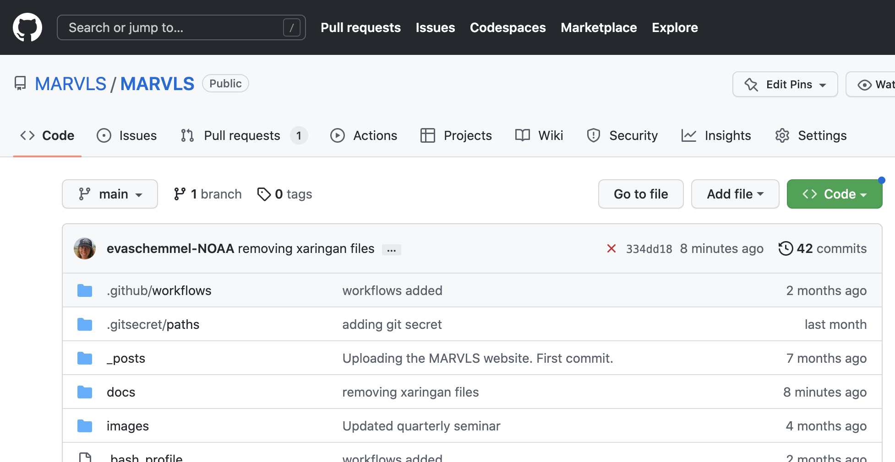
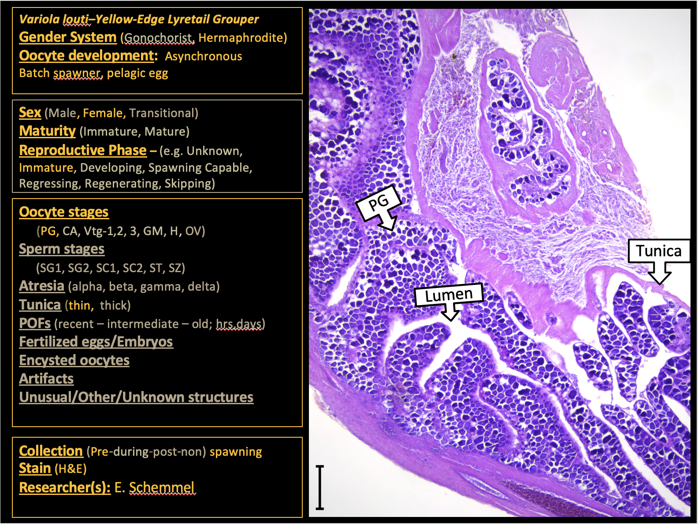

layout: true

.footnote[U.S. Department of Commerce | National Oceanic and Atmospheric Administration | National Marine Fisheries Service]

```{r setup, include=FALSE}
options(htmltools.dir.version = FALSE)
```

---

## MARVLS Website Purpose

Support MARVLS to:

* Hold meetings and workshops

* standardize methodology

* share accomplishments and challenges

* provide mentorship

* increase collaboration amongst scientists

---

## Websites & Github Reprositories
.left-column[

* Two Websites & Two Github Repositories


* Look for Github icon to go to the repository 


]

.right-column[
.hand-blue[


]]
---

## How to Contribute 1


.left-column[

[Please use issues for requesting changes to content](https://github.com/MARVLS/MARVLS/issues)

* Request change to text or report a typo

* Request format change

]
.right-column[
.hand-blue[




]
]

---

## How to Contribute 2

.left-column[

[Add Analyses ](https://github.com/MARVLS/Fish-Gonad-Staging/tree/main/analyses)

* Add R code for reproduction assessments here

* Use Pull Requests

]
.right-column[
.hand-blue[


]
]

---


## How to Contribute 3

.left-column[

[Add New Content ](https://docs.google.com/spreadsheets/d/1uC-vGAvOSiUSke6Y5pjCHCtO8hYK2HbuVZVa9b2t2p8/edit?usp=share_link)
* (Shared Drive -Contribute)[https://drive.google.com/drive/u/0/folders/1YeBkEyTUlrrj5RuktUUJJ42J0cS9t_Vp]
* Suggest new content

* Use google sheet

* Add the files that are not available online into the "Contributions" folder

]
.right-column[
.hand-blue[


]
]

---

## Histology Reference Template


.left-column[

[A template to document developmental sequences.](https://docs.google.com/presentation/d/1l6yKgd4srDlrYsEKtlQsRh-1FmZTicOrgmigT4Az-lo/edit#slide=id.p3)

* This template is useful for teaching and provides additional details that make them great references.


]
.right-column[
.hand-blue[


]
]


